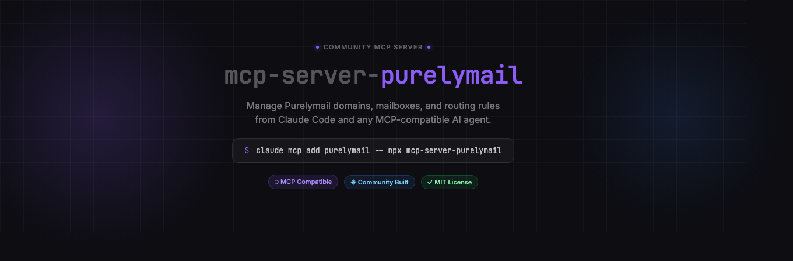
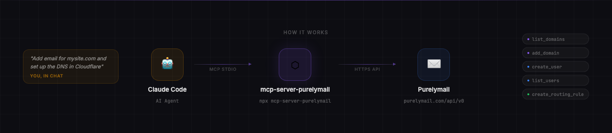

<p align="center">
  
</p>

<p align="center">
  <a href="https://www.npmjs.com/package/mcp-server-purelymail"></a>
  <a href="LICENSE"></a>
  
  
</p>

> **Disclaimer:** This is an **unofficial, community-built** MCP server. It is not affiliated with, endorsed by, or supported by Purelymail.

---

## What it does

Once installed, you can manage your Purelymail email infrastructure in plain language:

- _"Add email for mycompany.com and set up all the DNS records"_
- _"Create a mailbox for hello@mycompany.com with a strong password"_
- _"Forward support@ to our team's inboxes"_
- _"Show me the DNS status for all my domains"_

The agent handles the API calls. You describe the outcome.

<p align="center">
  
</p>

---

## Prerequisites

- **Node.js** 18 or later
- **Purelymail account** — [sign up at purelymail.com](https://purelymail.com)
- **API token** — generate one at [purelymail.com/manage/account](https://purelymail.com/manage/account)

---

## Installation

### Claude Code (recommended)

```bash
claude mcp add purelymail \
  --scope user \
  -e PURELYMAIL_API_TOKEN=your-token-here \
  -- npx mcp-server-purelymail
```

Replace `your-token-here` with your token from [purelymail.com/manage/account](https://purelymail.com/manage/account).

### From source

```bash
git clone https://github.com/zinxer/mcp-server-purelymail.git
cd mcp-server-purelymail
npm install
```

Then register it:

```bash
claude mcp add purelymail \
  --scope user \
  -e PURELYMAIL_API_TOKEN=your-token-here \
  -- node /absolute/path/to/mcp-server-purelymail/index.js
```

### Other MCP clients

Add to your MCP client's server config:

```json
{
  "mcpServers": {
    "purelymail": {
      "command": "npx",
      "args": ["mcp-server-purelymail"],
      "env": {
        "PURELYMAIL_API_TOKEN": "your-token-here"
      }
    }
  }
}
```

---

## Tools

### Domains

| Tool | Description |
|------|-------------|
| `list_domains` | List all domains with DNS validation status (MX, SPF, DKIM, DMARC) |
| `get_ownership_code` | Get the TXT record value needed to prove ownership of a new domain |
| `add_domain` | Add a domain once DNS records are in place |
| `delete_domain` | Delete a domain and all its associated mailboxes |

### Mailboxes

| Tool | Description |
|------|-------------|
| `create_user` | Create a new email mailbox |
| `list_users` | List all mailboxes on the account |
| `get_user` | Get details for a specific mailbox |
| `modify_user` | Change password, recovery email, or settings |
| `delete_user` | Delete a mailbox |

### Routing

| Tool | Description |
|------|-------------|
| `list_routing_rules` | List all routing and forwarding rules |
| `create_routing_rule` | Forward or alias an address to one or more inboxes |
| `delete_routing_rule` | Remove a routing rule |

---

## Example workflow

**Prompt:** _"Add email for acme.com on Purelymail and set up the DNS in Cloudflare"_

The agent will:

1. Call `get_ownership_code` → gets the exact TXT record value from the Purelymail API
2. Add TXT (ownership), MX, SPF, DKIM ×3, and DMARC records to Cloudflare
3. Call `add_domain` → registers `acme.com` once DNS passes

No copy-pasting. No looking up record values. No manual DNS entry.

---

## Security

- Your API token is **never stored in source code** — it is passed via environment variable only
- The server runs locally on your machine; no data is proxied through any third party
- Treat your `PURELYMAIL_API_TOKEN` like a password — do not commit it to version control

---

## Contributing

Issues and pull requests are welcome.

```bash
git clone https://github.com/zinxer/mcp-server-purelymail.git
cd mcp-server-purelymail
npm install
PURELYMAIL_API_TOKEN=your-token node index.js
```

Please open an issue before submitting large changes.

---

## License

MIT — see [LICENSE](LICENSE) for details.

---

## Disclaimer

This project was built by [Matthew Prag](https://github.com/zinxer) as an open-source community tool. **Purelymail** is a trademark of its respective owners. This project is independently developed and is **not affiliated with, endorsed by, or supported by Purelymail**. The Purelymail name is used solely to describe compatibility with the Purelymail service.

For official Purelymail support, visit [purelymail.com](https://purelymail.com).
